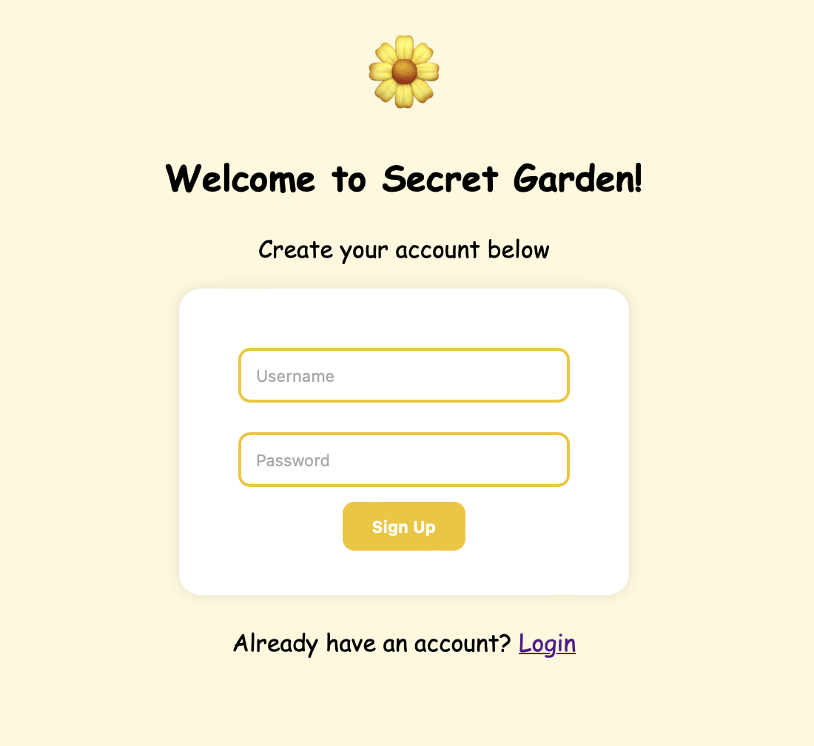
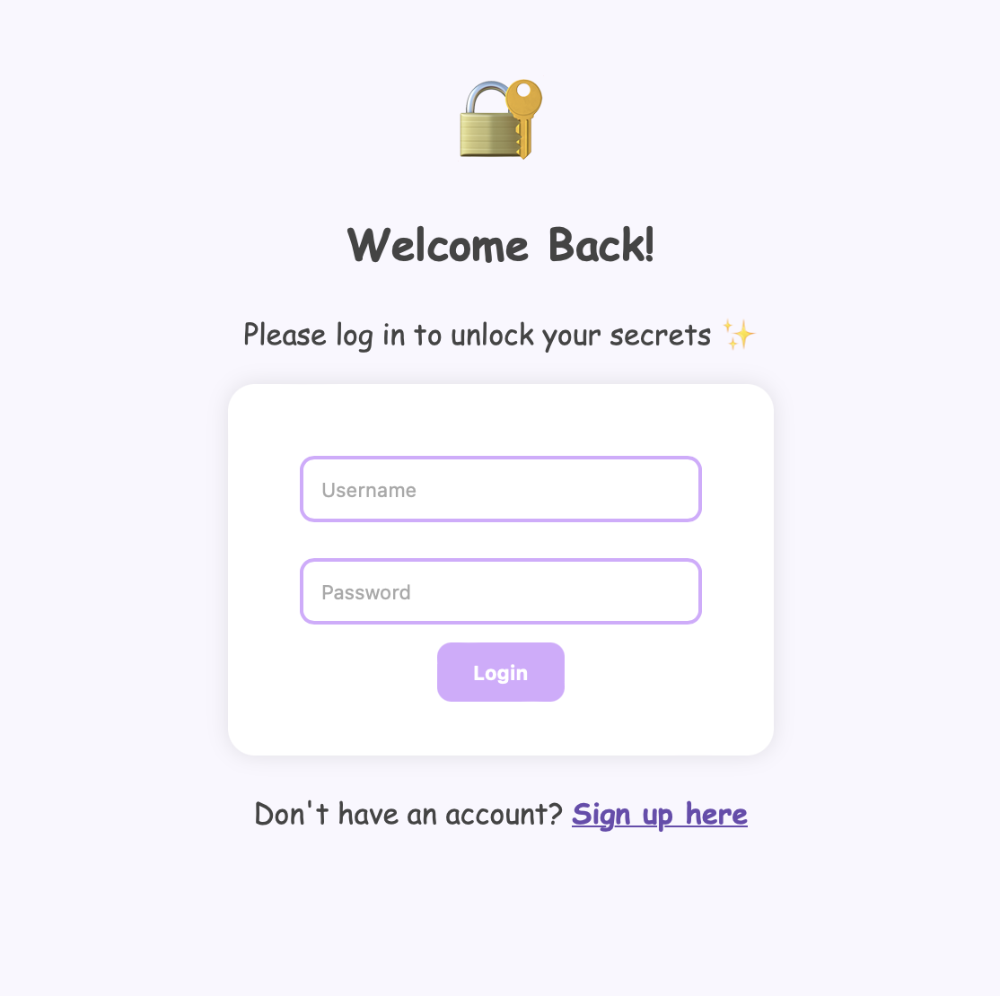
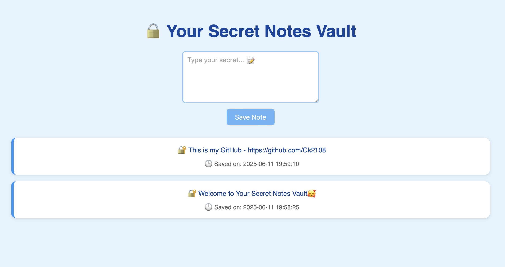

## Secure Note Vault


# 🔐 Secure Note Vault


> A beginner-friendly password & note vault with AES encryption, session security, and adorable UI 🌼  
> Built using Python, Flask, SQLite, Fernet, and Flask-Login

---

## 🌟 Features

- 🧠 Simple and Secure User Login (Flask-Login)
- 🔐 Notes encrypted with `Fernet` AES symmetric encryption
- 🕒 Auto timestamping of notes
- 💾 Stored locally in SQLite
- 🖥 Cute responsive UI (HTML + CSS)
- 🚫 No passwords or notes ever stored in plain text

---

## 🖼️ Screenshots

### 🐣 Sign Up Page  


### 🔐 Login Page  


### 📒 Dashboard Page  



---

## 🚀 Getting Started

### 1. Clone the repo

```bash
git clone https://github.com/Ck2108/Secure-Note-Vault.git
cd Secure-Note-Vault
````

### 2. Set up virtual environment

```bash
python3 -m venv venv
source venv/bin/activate
```

### 3. Install requirements

```bash
pip install -r requirements.txt
```

### 4. Initialize database

```bash
python init_db.py
```

### 5. Run the Flask app

```bash
python app.py
```

Now visit `http://127.0.0.1:5000` in your browser.

---

## 🔒 Security Details

* Passwords hashed using `Werkzeug`
* Notes encrypted using `cryptography.fernet` (AES)
* Sessions secured via `Flask`’s `secret_key`
* CSRF protection via Flask-Login
* Notes shown only to their respective users

---

## 🧑‍💻 Author

Made with 💛 by [Chinmayee Kale](https://github.com/Ck2108)

---

## 📜 License

MIT License – feel free to fork, remix, and star ⭐

